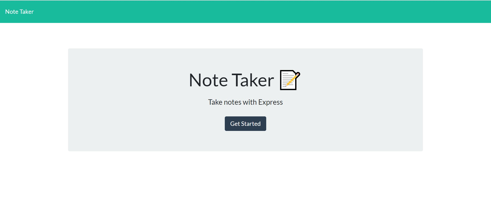
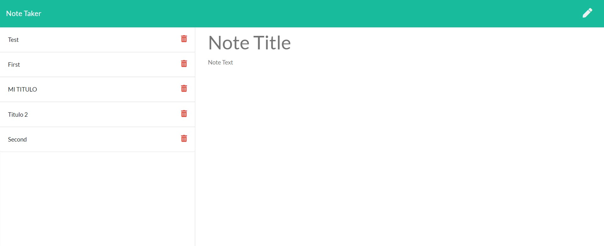
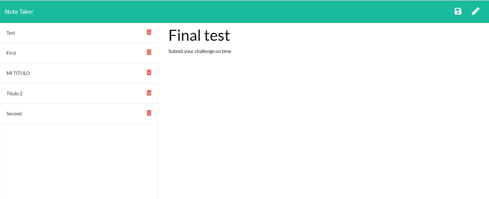

# Note taker
  This is an application that can be used to write, save and delete notes, using express backend and saving and retrieving note data from a JSON file. 

## Languages
JavaScript, Node.js, Express.js

##  link
The page can be found at:
<a href="https://note-taker-gamez21.herokuapp.com/">note-taker-gamez21.herokuapp.com/ </a>

## Screenshots
You need to press get started to move to the page where you can start saving notes.

On the left you will find the titles of the notes saved previously.You can create a new note by clicking on the pencil icon. A soon as you start creating a new note a save icon will apear.

This aplication lets you save and delete notes by clicking on the correct icons.

  

## Questions
  If you have questions please contactme me at: marthagamez211@gmail.com

  